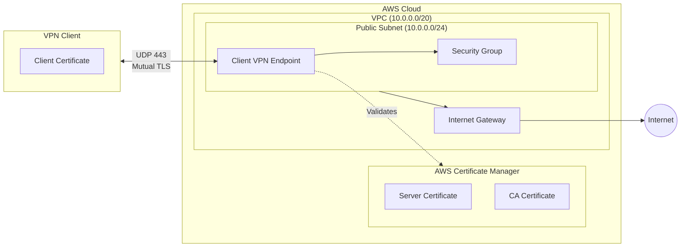
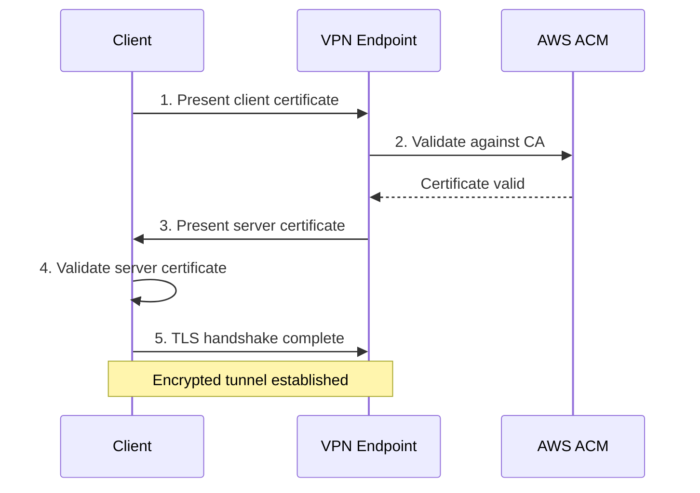
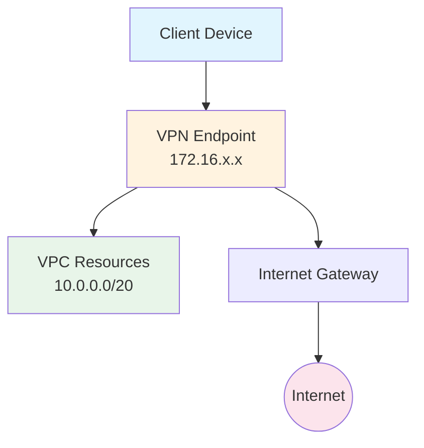
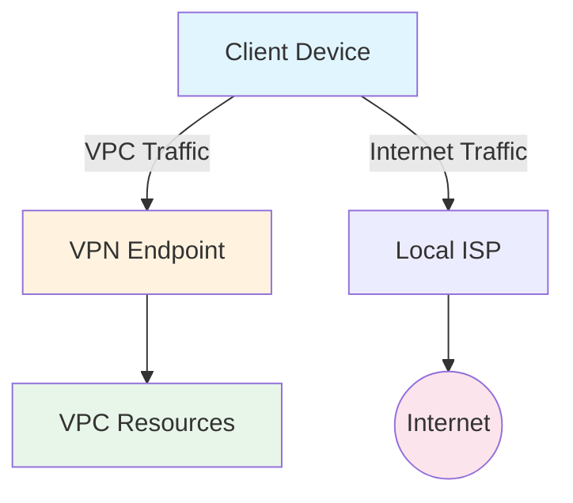
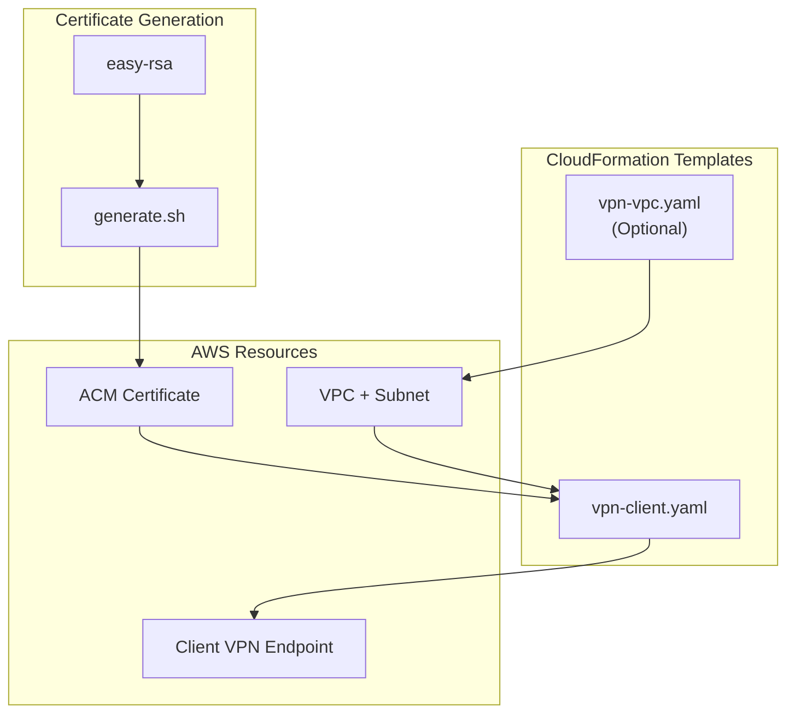

# Architecture

This document describes the architecture of the AWS Client VPN deployment.

## Overview

## Components

### VPC Infrastructure (vpn-vpc.yaml)

The optional VPC stack creates a foundational network with security best
practices:

| Component         | Description                                           |
| ----------------- | ----------------------------------------------------- |
| **VPC**           | Virtual Private Cloud with configurable CIDR          |
| **Public Subnet** | Single subnet in the first availability zone          |
| **Internet GW**   | Enables internet access from the VPC                  |
| **Route Table**   | Routes internet traffic through the IGW               |
| **Network ACLs**  | Layer 3/4 security rules                              |
| **DHCP Options**  | DNS configuration options                             |

**Network ACL Rules:**

The VPC includes secure Network ACL rules that:

- **Deny** SSH (port 22) and RDP (port 3389) from all sources
- **Allow** HTTP (80), HTTPS (443), and DNS (53)
- **Allow** RFC 1918 private network ranges for internal communication
- **Allow** high-numbered ports (1024-65535) for NAT responses

### VPN Client Infrastructure (vpn-client.yaml)

The VPN stack creates the Client VPN endpoint and associated resources:

| Component                     | Description                        |
| ----------------------------- | ---------------------------------- |
| **Client VPN Endpoint**       | Managed VPN termination point      |
| **Security Group**            | Controls access to VPN endpoint    |
| **Target Network Association**| Links endpoint to VPC subnet       |
| **Authorization Rules**       | Defines who can access what        |
| **Routes**                    | Network paths for VPN traffic      |

## Authentication Flow

This project uses **mutual TLS (mTLS)** authentication:

1. **Client Authentication**: The VPN client presents its certificate,
   which is validated against the CA certificate stored in ACM
2. **Server Authentication**: The VPN endpoint presents its certificate,
   which the client validates
3. **Encryption**: After successful mutual authentication, an encrypted
   tunnel is established

## Network Flow

### Full Tunnel Mode (SplitTunnel=false)

All traffic from the client is routed through the VPN:

### Split Tunnel Mode (SplitTunnel=true)

Only VPC-destined traffic goes through the VPN:

## Deployment Architecture

## Security Considerations

### Certificate Security

- Certificates are generated using OpenVPN's easy-rsa toolkit
- The default configuration uses passwordless keys for convenience
- **Production recommendation**: Use password-protected keys and a proper PKI

### Network Security

| Layer               | Control          | Purpose                          |
| ------------------- | ---------------- | -------------------------------- |
| Network ACL         | Deny SSH/RDP     | Prevent direct admin access      |
| Security Group      | Allow HTTPS only | Limit VPN endpoint exposure      |
| Authorization Rules | Per-CIDR access  | Control network access per group |

### Access Control

Authorization rules control which networks VPN clients can access:

| Rule            | Destination  | Description                       |
| --------------- | ------------ | --------------------------------- |
| Internet Access | 0.0.0.0/0    | Allow all clients internet access |
| VPC Access      | 10.0.0.0/20  | Allow all clients VPC access      |

## Scaling Considerations

### Client Capacity

- AWS Client VPN scales automatically
- Each endpoint supports up to 10 concurrent connections per subnet
- Add more subnet associations for higher capacity

### High Availability

For production deployments, consider:

1. **Multi-AZ deployment**: Associate the VPN endpoint with subnets in
   multiple AZs
2. **Connection logging**: Enable CloudWatch logging for monitoring
3. **Certificate rotation**: Implement a process for regular certificate
   renewal

## Cost Components

| Resource              | Billing                             |
| --------------------- | ----------------------------------- |
| Client VPN Endpoint   | Hourly rate per association         |
| Client VPN Connection | Hourly rate per active connection   |
| Data Transfer         | Standard AWS data transfer rates    |
| ACM                   | Free for imported certificates      |

See [AWS Client VPN Pricing](https://aws.amazon.com/vpn/pricing/) for
current rates.

## Related Resources

- [AWS Client VPN Administrator Guide][aws-vpn-guide]
- [OpenVPN easy-rsa](https://github.com/OpenVPN/easy-rsa)
- [AWS CloudFormation Documentation][aws-cfn-docs]

[aws-vpn-guide]: https://docs.aws.amazon.com/vpn/latest/clientvpn-admin/
[aws-cfn-docs]: https://docs.aws.amazon.com/cloudformation/
